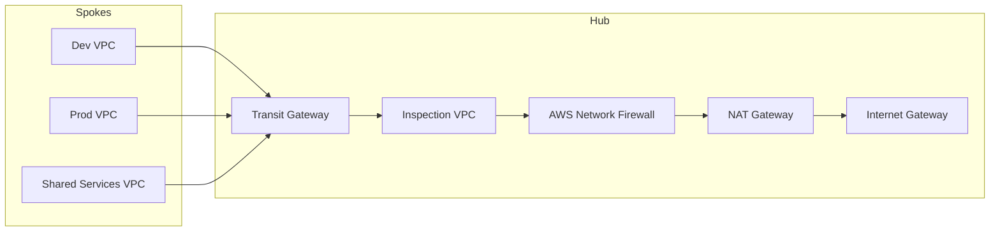

# 01 – Secure Multi-Account Network Core (Hub/Spoke + Inspection + AWS Network Firewall)

## Business scenario
A company is migrating multiple workloads to AWS. They require:
- Segmented networks (prod/dev/shared) with centralized routing controls
- A **central inspection layer** before internet egress
- Consistent egress rules + domain/port restrictions
- Clear operational runbooks for troubleshooting

This project builds a **hub/spoke** network core using:
- VPCs for **hub** (inspection/egress) and **spokes**
- **Transit Gateway (TGW)** for centralized routing
- **AWS Network Firewall** for stateful inspection and egress control
- Flow logs + CloudWatch logging for visibility

## Architecture


## What gets deployed
- 1 Transit Gateway with three attachments (dev/prod/shared)
- 1 Inspection VPC with Network Firewall in dedicated subnets
- TGW route tables:
  - Spoke RT → default route to Inspection
  - Hub RT → routes back to spokes
- Security logging:
  - VPC Flow Logs → CloudWatch Logs
  - Network Firewall logs → CloudWatch Logs

## Terraform
- `iac/terraform/modules/` contains reusable modules
- `iac/terraform/envs/dev` is a deployable environment with `dev.tfvars` fully populated

### Deploy
```bash
cd iac/terraform/envs/dev
terraform init
terraform plan -var-file=dev.tfvars
terraform apply -var-file=dev.tfvars
```

### Validate
From a test EC2 instance in Dev VPC (not created by default to reduce cost):
1. Confirm default route points to TGW
2. Confirm egress traffic is inspected (Network Firewall logs show flows)
3. Confirm blocked domains/ports are blocked (see firewall policy in Terraform)

Validation checklist: `docs/Validation-Checklist.md`

### Destroy
```bash
terraform destroy -var-file=dev.tfvars
```

## Notes on cost
- TGW and Network Firewall incur hourly charges and data processing.
- Keep this in a sandbox and destroy when done.

## Artifacts
- Threat model: `docs/Threat-Model.md`
- Runbook: `docs/Runbook.md`
- Validation: `docs/Validation-Checklist.md`
