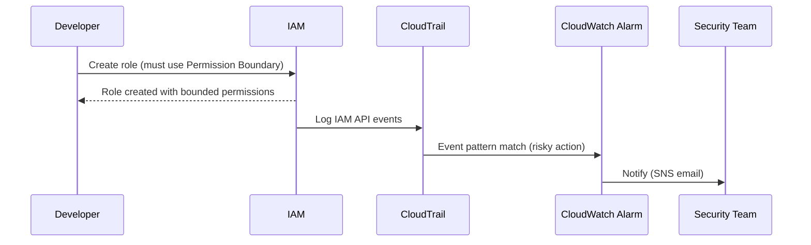

# 02 – IAM Zero-Trust Guardrails (Least Privilege + Permission Boundaries + Break-Glass)

## Business scenario
A growing organization wants to prevent common IAM failures:
- Over-privileged users and roles
- Accidental public access to data
- Developers attaching `AdministratorAccess` to roles
- Lack of a controlled emergency (break-glass) path

This project implements **practical IAM guardrails** using:
- **Permission boundaries** for IAM roles created by developers
- A **break-glass** admin role that requires MFA + CloudTrail visibility
- A set of **least-privilege roles** for common tasks (read-only, incident responder, deployer)
- CloudTrail + CloudWatch alarms to alert on risky IAM events

> Note: Service Control Policies (SCPs) are managed via AWS Organizations; this project includes an SCP pack in `docs/scp-pack/` and a deployable single-account equivalent using IAM policy boundaries.

## Architecture (control flow)


## What gets deployed
- `aws_iam_policy` Permission Boundary (prevents privilege escalation)
- Roles:
  - `ReadOnlyAuditorRole`
  - `IncidentResponderRole` (triage + read security services)
  - `DeployerRole` (limited deploy actions)
  - `BreakGlassAdminRole` (MFA required; tightly monitored)
- CloudTrail (management events) to S3 + CloudWatch Logs
- CloudWatch alarms for:
  - `CreatePolicyVersion`, `AttachUserPolicy`, `PutRolePolicy`, `UpdateAssumeRolePolicy`
  - Use of break-glass role
- SNS topic + email subscription

## Deploy

> **Important:** SNS email subscriptions require confirmation. After `terraform apply`, check your inbox and confirm the subscription.

```bash
cd iac/terraform/envs/dev
terraform init
terraform plan -var-file=dev.tfvars
terraform apply -var-file=dev.tfvars
```

## Validate
Use AWS CLI:
- Try creating a role without boundary (should be blocked if you enforce boundary via IAM condition on role-creation permissions in your admin policies)
- Assume `ReadOnlyAuditorRole` and confirm it cannot write resources
- Trigger an IAM risky action in a sandbox and confirm alert email is received

Validation checklist: `docs/Validation-Checklist.md`

## Artifacts
- Threat model: `docs/Threat-Model.md`
- SCP pack: `docs/scp-pack/` (Org-level controls)
- Runbook: `docs/Runbook.md`
